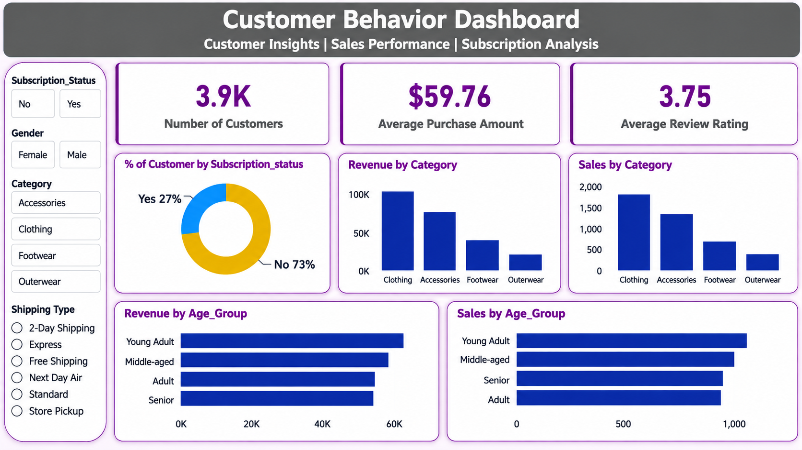
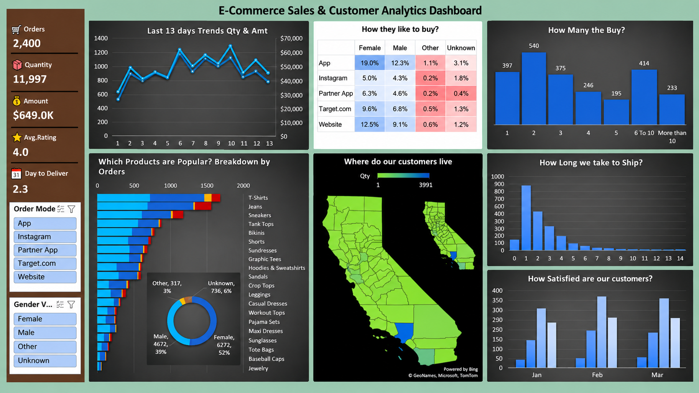
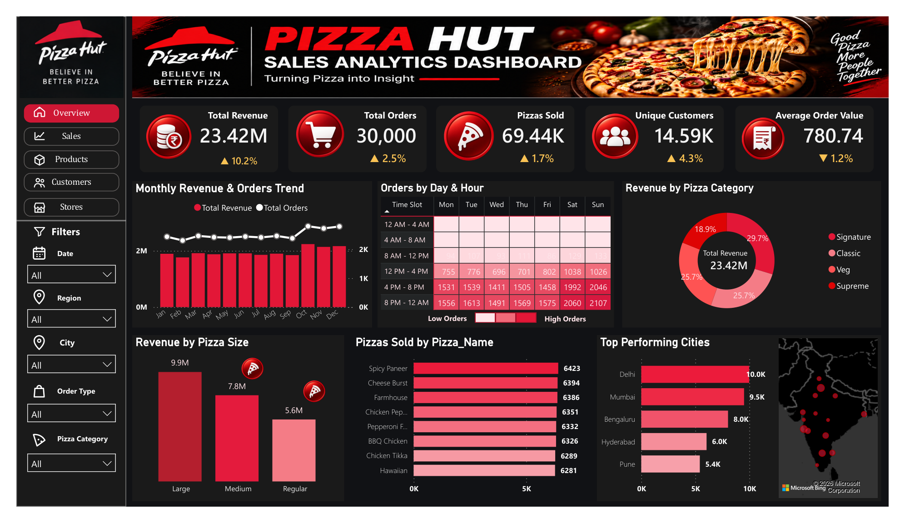

# 👨🏻‍💻 Data Analytics Portfolio

Welcome to my Data Analytics portfolio.

This repository contains my hands-on Data Analytics projects covering data cleaning, SQL analysis, Python, statistics, machine learning, Excel, and Power BI.

The goal of these projects is to transform raw data into meaningful business insights through data analysis and visualization.

---

## 🛠️ Tools & Technologies

- SQL
- Python
- Pandas
- NumPy
- Matplotlib
- Excel
- Power BI
- Machine Learning
- Statistics

---

## 📂 Projects

### 📊 01. Customer Behavior Analysis

An end-to-end customer behavior analysis project focused on understanding customer purchasing patterns, sales performance, revenue, product categories, demographics, subscription status, and customer reviews.

**Tools Used:**
- SQL
- Python
- Pandas
- Power BI
- Statistics

**Key Analysis:**
- Customer purchasing behavior
- Revenue by category
- Sales by category
- Customer demographics
- Subscription analysis
- Purchase frequency
- Review ratings
- Age-group analysis

**Power BI Dashboard:**

---

### 📈 02. E-Commerce Sales & Customer Analytics

An interactive **E-Commerce Sales & Customer Analytics Dashboard** built using Microsoft Excel to analyze sales performance, customer purchasing behavior, product popularity, delivery performance, geographic trends, and customer satisfaction.

**Tools Used:**
- Microsoft Excel
- Excel Formulas
- Calculated Columns
- Pivot Tables
- Pivot Charts
- Slicers
- Data Grouping
- Conditional Formatting
- Map Chart
- Data Visualization

**Key KPIs:**
- Total Orders
- Total Quantity
- Total Amount / Revenue
- Average Customer Rating
- Average Days to Delivery

**Key Analysis:**
- 13-week sales trend
- Customer purchase patterns
- Order mode analysis
- Gender-based analysis
- Quantity distribution
- Most popular products
- Geographic customer analysis
- Delivery performance
- Customer satisfaction
- Interactive dashboard filtering using slicers

**Excel Dashboard:**

**Project Files:**

[📂 View Excel Project](Excel/)

---

### 🍕 03. Pizza Hut Sales Analytics Dashboard

An end-to-end **Pizza Hut-style Sales Analytics Dashboard** built using Microsoft Power BI to analyze revenue, orders, pizza sales, product performance, customer activity, city performance, ordering patterns, and sales trends.

> **Data Disclaimer:** This project uses a synthetic Pizza Hut-style dataset created for learning, portfolio, and practice purposes. It is not internal or confidential Pizza Hut data.

**Tools Used:**
- Power BI
- Power Query
- DAX
- SQL
- Microsoft Excel
- Data Modeling
- Star Schema
- Data Visualization

**Key KPIs:**
- Total Revenue
- Total Orders
- Pizzas Sold
- Revenue Growth
- Orders Growth
- Pizza Sales Growth

**Key Analysis:**
- Monthly Revenue & Orders Trend
- Orders by Day & Hour
- Revenue by Pizza Size
- Pizzas Sold by Pizza Name
- Revenue by Pizza Category
- Top Performing Cities
- Date analysis
- Region analysis
- City analysis
- Pizza Category analysis
- Pizza Size analysis
- Order Type analysis

**Dashboard Features:**
- Interactive slicers
- Date filtering
- Region filtering
- City filtering
- Pizza Category filtering
- Pizza Size filtering
- Order Type filtering
- Interactive navigation buttons
- Overview dashboard
- Dark/red Pizza Hut-style theme
- KPI cards
- Business-focused visualizations

**Power BI Dashboard:**

**Project Files:**

[📂 View Pizza Hut Power BI Project](Pizza-Hut-Sales-Analytics-Dashboard/)

---

## 📌 Skills Demonstrated

- Data Cleaning & Transformation
- Exploratory Data Analysis (EDA)
- SQL Querying
- Statistical Analysis
- Data Visualization
- Excel Dashboard Development
- Power BI Dashboard Development
- DAX
- Power Query
- Data Modeling
- Star Schema
- Business Intelligence
- Business Problem Solving
- Machine Learning

---

## 🎯 About Me

I am currently developing my skills in Data Analytics and working on practical projects using SQL, Python, Excel, Power BI, Statistics, and Machine Learning.

I am passionate about using data to identify patterns, generate insights, and support data-driven business decisions.

---

## 📫 Connect With Me

- LinkedIn: [My LinkedIn Profile](https://www.linkedin.com/in/abhishek-vishwakarma-a79632339/)
- GitHub: [My GitHub Profile](https://github.com/AbhishekV2609)

---

## ⭐ Thanks for Visiting

Thank you for checking out my Data Analytics portfolio!

Feel free to explore the projects and connect with me.
